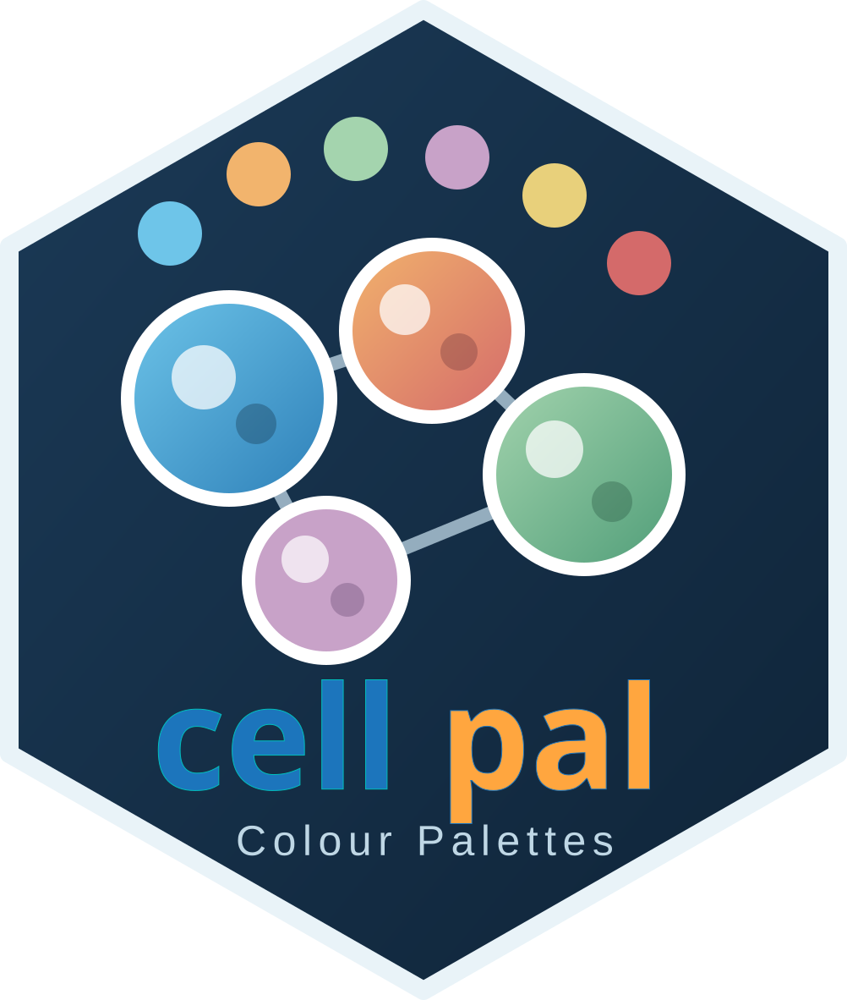

---
output:
  github_document:
    toc: false
    fig_width: 8
    fig_height: 4.5
    dev: ragg_png
always_allow_html: true
---

```{r setup, include=FALSE}
knitr::opts_chunk$set(
  collapse = TRUE,
  comment = "#>",
  fig.width = 8,
  fig.height = 4.5,
  dpi = 144,
  dev = "ragg_png",
  fig.path = "man/figures/README-",
  out.width = "100%"
)
```


<div align="center">

</div>


<!-- README.md is generated from README.Rmd. Please edit README.Rmd only. -->

<!-- badges: start -->

[](https://lifecycle.r-lib.org/articles/stages.html#experimental)
[](https://opensource.org/licenses/MIT)

<!-- badges: end -->

**cellpal** provides publication-ready colour palettes for single-cell, spatial transcriptomics, bulk RNA-seq, and general scientific visualization in R.

The package includes:

- categorical palettes for cell types, clusters, samples, and experimental groups;
- sequential and diverging palettes for continuous biological measurements;
- direct integration with `ggplot2`;
- stable named colour mappings;
- palette previews and galleries;
- colour adjustment utilities;
- colour-vision-deficiency simulations;
- contrast and accessibility diagnostics;
- helpers for Seurat visualizations.

## Installation

Install the development version from GitHub:

```{r installation, eval=FALSE}
# install.packages("remotes")
remotes::install_github("ymbouamboua/cellpal")
```

Load the package:

```{r load-package}
library(cellpal)
```

## Quick start

Retrieve colours from a built-in palette:

```{r}
cellpal(
  palette = "nature",
  n = 5
)
```

Generate a larger discrete palette:

```{r}
cellpal(
  palette = "base",
  n = 20,
  type = "discrete"
)
```

Interpolate a continuous palette:

```{r}
cellpal(
  palette = "heatmap_nature",
  n = 50,
  type = "continuous"
)
```

Reverse a palette:

```{r}
cellpal(
  palette = "nature",
  n = 5,
  reverse = TRUE
)
```

Apply transparency:

```{r}
cellpal(
  palette = "nature",
  n = 5,
  alpha = 0.6
)
```

## Available palettes

List all registered palettes:

```{r}
cellpal_names()
```

List palettes by type:

```{r}
cellpal_names("categorical")
cellpal_names("sequential")
cellpal_names("diverging")
```

Inspect a palette:

```{r}
cellpal_palette_info("nature")
```

Check whether a palette exists:

```{r}
cellpal_exists("nature")
cellpal_exists("unknown_palette")
```

## Palette preview

Preview a single palette:

```{r palette-preview, fig.width=8, fig.height=2.5}
cellpal_view(
  "nature",
  labels = TRUE
)
```

Preview labels below the colour swatches:

```{r}
cellpal_view(
  "nature",
  label_position = "below"
)
```

Preview a generated palette:

```{r}
pal <- cellpal(
  "heatmap_nature",
  n = 20,
  type = "continuous"
)

cellpal_view(
  pal,
  labels = FALSE
)
```

## Palette gallery

Display several palettes together:

```{r palette-gallery, fig.width=8, fig.height=5}
cellpal_gallery(
  palettes = c(
    "nature",
    "jama",
    "nejm",
    "lancet",
    "okabe_ito",
    "heatmap_nature"
  ),
  labels = FALSE
)
```

Display all palettes of one type:

```{r}
cellpal_gallery(
  type = "categorical",
  labels = FALSE
)
```

## ggplot2 integration

`cellpal` provides colour and fill scales for `ggplot2`.

```{r }
library(ggplot2)

set.seed(123)

example_data <- data.frame(
  group = rep(
    c("Control", "Treatment A", "Treatment B"),
    each = 20
  ),
  x = rep(1:20, times = 3),
  y = c(
    cumsum(rnorm(20, 0.1)),
    cumsum(rnorm(20, 0.2)),
    cumsum(rnorm(20, 0.3))
  )
)

ggplot(
  example_data,
  aes(
    x = x,
    y = y,
    colour = group
  )
) +
  geom_line(
    linewidth = 1
  ) +
  scale_colour_cellpal_d(
    palette = "nature"
  ) +
  theme_minimal(
    base_size = 12
  ) +
  labs(
    colour = NULL,
    x = "Observation",
    y = "Value"
  )

```

Use a fill scale:

```{r ggplot-fill, fig.width=7, fig.height=4.5}
bar_data <- data.frame(
  cell_type = c(
    "T cells",
    "B cells",
    "Myeloid",
    "Epithelial",
    "Endothelial"
  ),
  count = c(
    320,
    210,
    280,
    410,
    150
  )
)

ggplot(
  bar_data,
  aes(
    x = reorder(cell_type, count),
    y = count,
    fill = cell_type
  )
) +
  geom_col(
    width = 0.75
  ) +
  coord_flip() +
  scale_fill_cellpal_d(
    palette = "nature"
  ) +
  theme_minimal(
    base_size = 12
  ) +
  theme(
    legend.position = "none"
  ) +
  labs(
    x = NULL,
    y = "Number of cells"
  )
```

The American spelling alias is also available:

```{r alias-example, eval=FALSE}
scale_color_cellpal_d()
```

## Stable named colour mappings

Use `cellpal_named()` to assign reproducible colours to biological categories.

```{r}
cell_types <- c(
  "T cells",
  "B cells",
  "Myeloid",
  "Epithelial",
  "Endothelial"
)

cell_type_colours <- cellpal_named(
  levels = cell_types,
  palette = "nature"
)

cell_type_colours
```

The result is a named vector that can be reused across several plots.

```{r}
ggplot(
  bar_data,
  aes(
    x = reorder(cell_type, count),
    y = count,
    fill = cell_type
  )
) +
  geom_col() +
  scale_fill_manual(
    values = cell_type_colours
  )
```

## Seurat integration

Create a named palette from Seurat identities:

```{r seurat-palette, eval=FALSE}
seurat_colours <- cellpal_seurat(
  object = seurat_object,
  palette = "base"
)
cellpal_view(seurat_colours)
```

Apply it to a dimensional reduction plot:

```{r seurat-dimplot, eval=FALSE}
Seurat::DimPlot(
  seurat_object,
  group.by = "seurat_clusters",
  cols = seurat_colours
)
```

You can also generate colours directly from identity levels:

```{r seurat-levels, eval=FALSE}
seurat_colours <- cellpal_named(
  levels = levels(Seurat::Idents(seurat_object)),
  palette = "base"
)
cellpal_view(seurat_colours)
```

## Palette adjustment

### Lighten or darken colours

Positive values lighten colours:

```{r}
lighter <- cellpal_lightness(
  "nature",
  amount = 0.2
)
cellpal_view(lighter)
```

Negative values darken colours:

```{r}
darker <- cellpal_lightness(
  "nature",
  amount = -0.2
)
cellpal_view(darker)
```

Adjust selected colours only:

```{r}
adjusted <- cellpal_lightness(
  "nature",
  amount = 0.25,
  which = c(1, 3)
)
cellpal_view(adjusted)
```

### Adjust every colour separately

```{r}
custom_adjustment <- cellpal_adjust_each(
  "nature",
  adjustments = c(
    -0.15,
    0,
    0.10,
    0.20,
    -0.05
  )
)
cellpal_view(custom_adjustment)
```

### Adjust saturation

```{r}
muted <- cellpal_saturation(
  "nature",
  factor = 0.6
)
cellpal_view(muted)

stronger <- cellpal_saturation(
  "nature",
  factor = 1.2
)
cellpal_view(stronger)
```

### Desaturate colours

```{r}
desaturated <- cellpal_desaturate(
  "nature",
  amount = 0.5
)
cellpal_view(desaturated)
```

### Add transparency

```{r}
transparent <- cellpal_alpha(
  "nature",
  alpha = 0.5
)
cellpal_view(transparent)
```

## Colour accessibility

### Simulate colour-vision deficiencies

```{r}
cvd_palettes <- cellpal_simulate_cvd(
  "nature"
)

cvd_palettes$Normal
cvd_palettes$Deuteranopia
cvd_palettes$Protanopia
cvd_palettes$Tritanopia
```

Visualize the simulations:

```{r cvd-preview, fig.width=8, fig.height=4.5}
cellpal_cvd(
  "nature",
  severity = 1,
  labels = TRUE
)
```

### Calculate contrast ratios

```{r}
cellpal_contrast(
  "nature",
  background = c(
    "white",
    "black"
  )
)
```

### Calculate pairwise colour distances

```{r}
cellpal_distances(
  "nature"
)
```

### Generate an accessibility report

```{r}
accessibility_report <- cellpal_accessibility(
  "nature",
  minimum_distance = 15
)

accessibility_report
```

## Custom palettes

In addition to the built-in palettes, **cellpal** allows you to create and register your own colour palettes.

Registered palettes behave exactly like built-in palettes and can be used with all `cellpal` functions, including `cellpal()`, `cellpal_view()`, and the `ggplot2` scales.

### Register a custom palette

```{r}
cellpal_register(
  name = "my_palette",
  colours = c(
    "#264653",
    "#2A9D8F",
    "#E9C46A",
    "#F4A261",
    "#E76F51"
  ),
  type = "categorical"
)

cellpal_names()
```

Retrieve colours:

```{r custom-retrieve}
cellpal(
  palette = "my_palette",
  n = 5
)
```

### Preview the palette

```{r}
cellpal_view("my_palette")
```

### Use the palette in ggplot2

```{r}
library(ggplot2)

df <- data.frame(
  group = LETTERS[1:5],
  value = c(4, 7, 3, 9, 6)
)

ggplot(df, aes(group, value, fill = group)) +
  geom_col() +
  scale_fill_cellpal_d(
    palette = "my_palette"
  ) +
  theme_minimal()
```

### List registered palettes

```{r}
cellpal_custom_names()
```

### Remove a registered palette

```{r}
cellpal_unregister("my_palette")
```

> **Note:** Registered palettes are available only during the current R session. If you restart R, they must be registered again.

## Heatmaps

Generate a continuous diverging palette:

```{r}
heatmap_colours <- cellpal(
  palette = "heatmap_nature",
  n = 100,
  type = "continuous"
)
```

Use it with `pheatmap`:

```{r pheatmap-example, eval=FALSE}
set.seed(123)

# Simulated RNA-seq counts
counts <- matrix(
  rpois(20 * 10, lambda = 100),
  nrow = 20,
  dimnames = list(
    paste0("Gene_", 1:20),
    paste0("Sample_", 1:10)
  )
)

# Gene-wise Z-score normalization
expression_matrix <- t(
  scale(
    t(log2(counts + 1))
  )
)

heatmap_colours <- cellpal(
  "heatmap_nature",
  n = 100,
  type = "continuous"
)

pheatmap::pheatmap(
  expression_matrix,
  color = heatmap_colours,
  border_color = NA,
  cluster_rows = TRUE,
  cluster_cols = TRUE,
  main = "Normalized RNA-seq Expression"
)
```

Use it with `ComplexHeatmap`:

```{r complexheatmap-example, eval=FALSE}
# heatmap_colours <- cellpal(
#   "viridis",
#   n = 100,
#   type = "continuous"
# )

ComplexHeatmap::Heatmap(
  expression_matrix,
  col = heatmap_colours
)
```

## Example single-cell colour workflow

```{r single-cell-workflow, eval=FALSE}
cell_types <- c(
  "Basal",
  "Cycling basal",
  "Neuronal progenitor",
  "Immature neuron",
  "Mature neuron",
  "Sustentacular",
  "Microvillous",
  "Endothelial",
  "Mesenchymal"
)

cell_type_colours <- cellpal_named(
  levels = cell_types,
  palette = "base"
)

Seurat::DimPlot(
  seurat_object,
  group.by = "cell_type",
  cols = cell_type_colours,
  label = TRUE,
  repel = TRUE
)
```

## Design principles

1. **Reproducibility**  
   Named mappings keep colours stable across analyses and figures.

2. **Scientific readability**  
   Palettes are designed for figures, reports, presentations, and publications.

3. **Accessibility**  
   Built-in tools help evaluate colour-vision-deficiency robustness and contrast.

4. **Interoperability**  
   Colours can be used with `ggplot2`, Seurat, `pheatmap`, `ComplexHeatmap`, and base R.

5. **Minimal dependencies**  
   Core palette generation remains lightweight and easy to integrate into existing workflows.

## Development

Run package tests:

```{r development-tests, eval=FALSE}
devtools::test()
```

Generate documentation:

```{r development-document, eval=FALSE}
devtools::document()
```

Run a complete package check:

```{r development-check, eval=FALSE}
devtools::check()
```

Build this README from `README.Rmd`:

```{r development-readme, eval=FALSE}
devtools::build_readme()
```

Build the pkgdown website:

```{r development-pkgdown, eval=FALSE}
pkgdown::build_site()
```

## Contributing

Contributions, bug reports, feature requests, and palette suggestions are welcome.

Please open an issue with:

- a clear description of the problem or proposed feature;
- a minimal reproducible example;
- the output of `sessionInfo()`;
- screenshots when the issue concerns colour rendering or plot appearance.

## Citation

If you use `cellpal` in scientific work, please cite the package using:

```{r citation, eval=FALSE}
citation("cellpal")
```

## License

`cellpal` is released under the MIT License.

## Author

**Yvon Mbouamboua**  
Bioinformatician and scientific software developer  
INSERM — Lille Neuroscience & Cognition, UMR-S 1172  
Lille, France
