<div align="center">


</div>

<!-- README.md is generated from README.Rmd. Please edit README.Rmd only. -->

# cellpal

<!-- badges: start -->

[](https://github.com/ymbouamboua/cellpal/actions/workflows/R-CMD-check.yaml)
[](https://lifecycle.r-lib.org/articles/stages.html#experimental)
[](https://opensource.org/licenses/MIT)

<!-- badges: end -->

**cellpal** provides publication-ready colour palettes for single-cell,
spatial transcriptomics, bulk RNA-seq, and general scientific
visualization in R.

The package includes:

- categorical palettes for cell types, clusters, samples, and
  experimental groups;
- sequential and diverging palettes for continuous biological
  measurements;
- direct integration with `ggplot2`;
- stable named colour mappings;
- palette previews and galleries;
- colour adjustment utilities;
- colour-vision-deficiency simulations;
- contrast and accessibility diagnostics;
- helpers for Seurat visualizations.

## Installation

Install the development version from GitHub:

``` r
# install.packages("remotes")
remotes::install_github("ymbouamboua/cellpal")
```

Load the package:

``` r
library(cellpal)
```

## Quick start

Retrieve colours from a built-in palette:

``` r
cellpal(
  palette = "nature",
  n = 5
)
#> <cellpal palette>
#> Name:    nature
#> Type:    categorical
#> Mode:    discrete
#> Colours: 5
#> 1: #E64B35
#> 2: #4DBBD5
#> 3: #00A087
#> 4: #3C5488
#> 5: #F39B7F
```

Generate a larger discrete palette:

``` r
cellpal(
  palette = "base",
  n = 20,
  type = "discrete"
)
#> <cellpal palette>
#> Name:    base
#> Type:    categorical
#> Mode:    discrete
#> Colours: 20
#> 1: #E41A1C
#> 2: #68618B
#> 3: #409388
#> 4: #57A156
#> 5: #8D5B96
#> 6: #CB7647
#> 7: #F38E38
#> 8: #F781BE
#> 9: #CC95C8
#> 10: #B27E85
#> 11: #9A6242
#> 12: #5FA3C9
#> 13: #3766A4
#> 14: #204E75
#> 15: #1B9D77
#> 16: #86CC84
#> 17: #D3EC90
#> 18: #FBF583
#> 19: #E7C715
#> 20: #F0A957
```

Interpolate a continuous palette:

``` r
cellpal(
  palette = "heatmap_nature",
  n = 50,
  type = "continuous"
)
#> <cellpal palette>
#> Name:    heatmap_nature
#> Type:    diverging
#> Mode:    continuous
#> Colours: 50
#> 1: #6497B1
#> 2: #6A9AB3
#> 3: #709EB6
#> 4: #77A2B9
#> 5: #7DA6BC
#> 6: #83A9BF
#> 7: #89ADC1
#> 8: #8FB1C4
#> 9: #95B5C7
#> 10: #9BB9CA
#> 11: #A1BDCD
#> 12: #A7C1D0
#> 13: #ADC4D2
#> 14: #B3C8D5
#> 15: #B8CCD8
#> 16: #BED0DB
#> 17: #C4D4DE
#> 18: #CAD8E1
#> 19: #D0DCE4
#> 20: #D6E0E7
#> 21: #DCE4E9
#> 22: #E2E8EC
#> 23: #E8ECEF
#> 24: #EEF0F2
#> 25: #F4F4F5
#> 26: #F5F2F1
#> 27: #F1E8E6
#> 28: #EDDEDA
#> 29: #E9D4CF
#> 30: #E4CAC4
#> 31: #E0C0BA
#> 32: #DBB7AF
#> 33: #D7ADA4
#> 34: #D2A49A
#> 35: #CD9A8F
#> 36: #C89185
#> 37: #C3887B
#> 38: #BD7E71
#> 39: #B87567
#> 40: #B26C5D
#> 41: #AD6354
#> 42: #A7594A
#> 43: #A15041
#> 44: #9B4738
#> 45: #943E2F
#> 46: #8E3426
#> 47: #882A1E
#> 48: #811F15
#> 49: #7A120C
#> 50: #730000
```

Reverse a palette:

``` r
cellpal(
  palette = "nature",
  n = 5,
  reverse = TRUE
)
#> <cellpal palette>
#> Name:    nature
#> Type:    categorical
#> Mode:    discrete
#> Colours: 5
#> 1: #F39B7F
#> 2: #3C5488
#> 3: #00A087
#> 4: #4DBBD5
#> 5: #E64B35
```

Apply transparency:

``` r
cellpal(
  palette = "nature",
  n = 5,
  alpha = 0.6
)
#> <cellpal palette>
#> Name:    nature
#> Type:    categorical
#> Mode:    discrete
#> Colours: 5
#> 1: #E64B3599
#> 2: #4DBBD599
#> 3: #00A08799
#> 4: #3C548899
#> 5: #F39B7F99
```

## Available palettes

List all registered palettes:

``` r
cellpal_names()
#>  [1] "base"             "nature"           "nejm"             "lancet"          
#>  [5] "jama"             "tableau"          "tol"              "okabe_ito"       
#>  [9] "heatmap_blue_red" "heatmap_nature"   "viridis"
```

List palettes by type:

``` r
cellpal_names("categorical")
#> [1] "base"      "nature"    "nejm"      "lancet"    "jama"      "tableau"  
#> [7] "tol"       "okabe_ito"
cellpal_names("sequential")
#> [1] "viridis"
cellpal_names("diverging")
#> [1] "heatmap_blue_red" "heatmap_nature"
```

Inspect a palette:

``` r
cellpal_palette_info("nature")
#> $name
#> [1] "nature"
#> 
#> $colours
#> [1] "#E64B35" "#4DBBD5" "#00A087" "#3C5488" "#F39B7F"
#> 
#> $n_colours
#> [1] 5
#> 
#> $type
#> [1] "categorical"
#> 
#> $source
#> [1] "built-in"
#> 
#> $metadata
#>     name        type recommended_max                           description
#> 2 nature categorical               5 Journal-inspired categorical palette.
#> 
#> attr(,"class")
#> [1] "cellpal_palette_info"
```

Check whether a palette exists:

``` r
cellpal_exists("nature")
#> [1] TRUE
cellpal_exists("unknown_palette")
#> [1] FALSE
```

## Palette preview

Preview a single palette:

``` r
cellpal_view(
  "nature",
  labels = TRUE
)
```

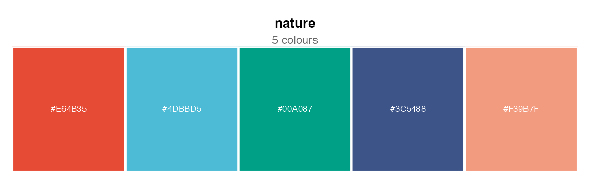

Preview labels below the colour swatches:

``` r
cellpal_view(
  "nature",
  label_position = "below"
)
```

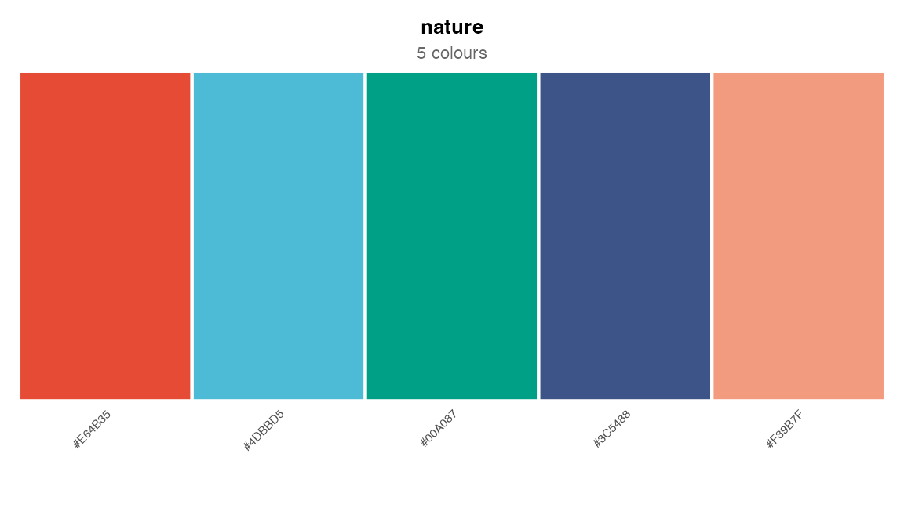

Preview a generated palette:

``` r
pal <- cellpal(
  "heatmap_nature",
  n = 20,
  type = "continuous"
)

cellpal_view(
  pal,
  labels = FALSE
)
```

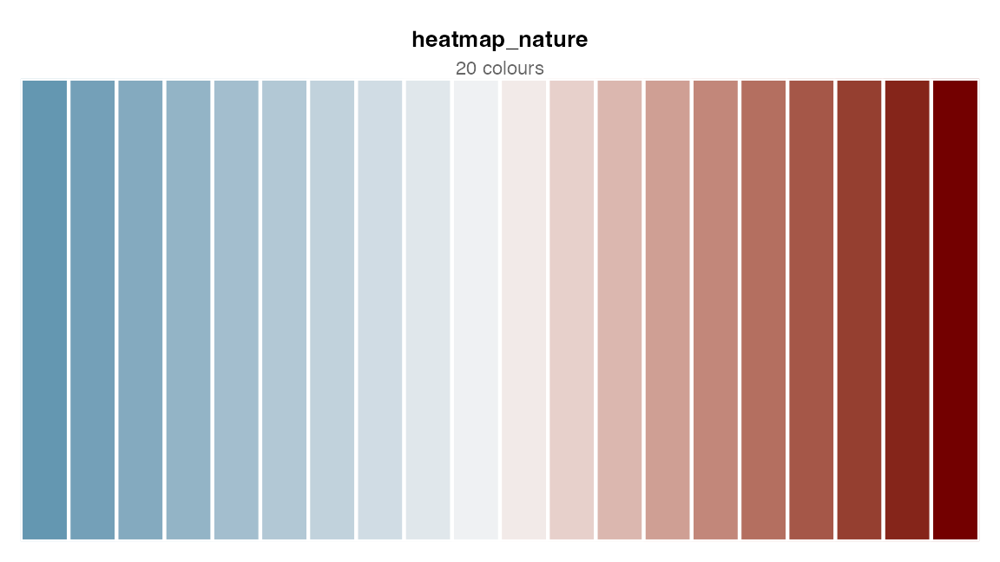

## Palette gallery

Display several palettes together:

``` r
cellpal_gallery(
  palettes = c(
    "nature",
    "jama",
    "nejm",
    "lancet",
    "okabe_ito",
    "heatmap_nature"
  ),
  labels = FALSE
)
```

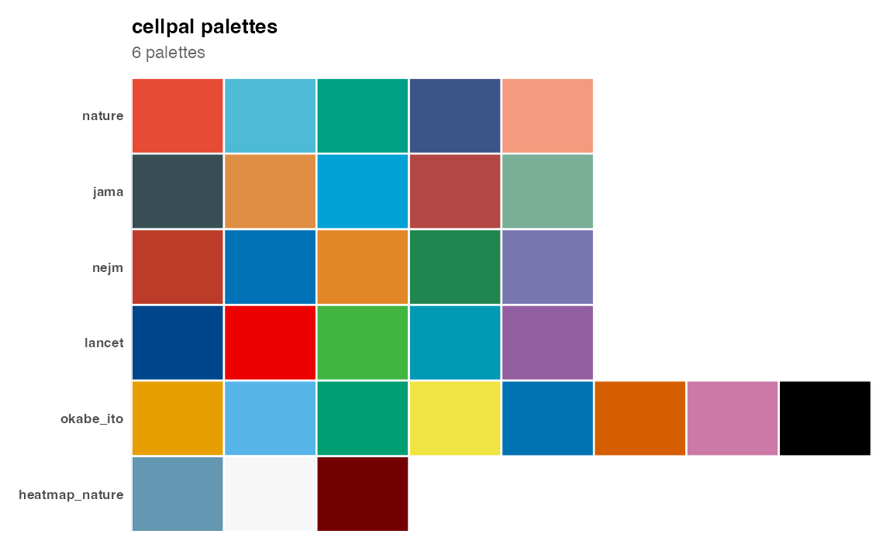

Display all palettes of one type:

``` r
cellpal_gallery(
  type = "categorical",
  labels = FALSE
)
```

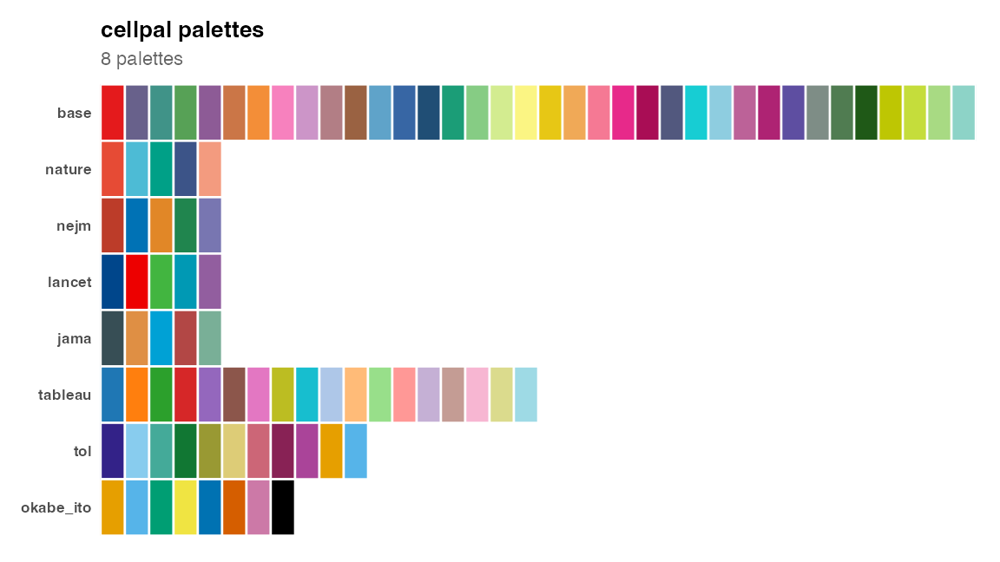

## ggplot2 integration

`cellpal` provides colour and fill scales for `ggplot2`.

``` r
library(ggplot2)
#> Warning: package 'ggplot2' was built under R version 4.5.2

set.seed(123)

example_data <- data.frame(
  group = rep(
    c("Control", "Treatment A", "Treatment B"),
    each = 20
  ),
  x = rep(1:20, times = 3),
  y = c(
    cumsum(rnorm(20, 0.1)),
    cumsum(rnorm(20, 0.2)),
    cumsum(rnorm(20, 0.3))
  )
)

ggplot(
  example_data,
  aes(
    x = x,
    y = y,
    colour = group
  )
) +
  geom_line(
    linewidth = 1
  ) +
  scale_colour_cellpal_d(
    palette = "nature"
  ) +
  theme_minimal(
    base_size = 12
  ) +
  labs(
    colour = NULL,
    x = "Observation",
    y = "Value"
  )
```

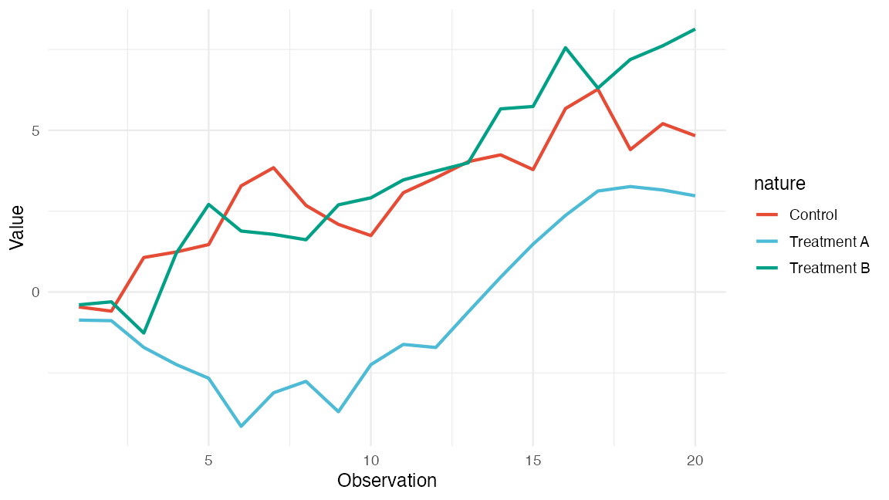

Use a fill scale:

``` r
bar_data <- data.frame(
  cell_type = c(
    "T cells",
    "B cells",
    "Myeloid",
    "Epithelial",
    "Endothelial"
  ),
  count = c(
    320,
    210,
    280,
    410,
    150
  )
)

ggplot(
  bar_data,
  aes(
    x = reorder(cell_type, count),
    y = count,
    fill = cell_type
  )
) +
  geom_col(
    width = 0.75
  ) +
  coord_flip() +
  scale_fill_cellpal_d(
    palette = "nature"
  ) +
  theme_minimal(
    base_size = 12
  ) +
  theme(
    legend.position = "none"
  ) +
  labs(
    x = NULL,
    y = "Number of cells"
  )
```

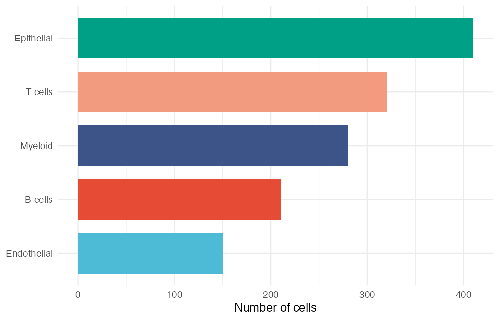

The American spelling alias is also available:

``` r
scale_color_cellpal_d()
```

## Stable named colour mappings

Use `cellpal_named()` to assign reproducible colours to biological
categories.

``` r
cell_types <- c(
  "T cells",
  "B cells",
  "Myeloid",
  "Epithelial",
  "Endothelial"
)

cell_type_colours <- cellpal_named(
  levels = cell_types,
  palette = "nature"
)

cell_type_colours
#> <cellpal palette>
#> Name:    nature
#> Type:    categorical
#> Mode:    discrete
#> Colours: 5
#> 1: #E64B35
#> 2: #4DBBD5
#> 3: #00A087
#> 4: #3C5488
#> 5: #F39B7F
```

The result is a named vector that can be reused across several plots.

``` r
ggplot(
  bar_data,
  aes(
    x = reorder(cell_type, count),
    y = count,
    fill = cell_type
  )
) +
  geom_col() +
  scale_fill_manual(
    values = cell_type_colours
  )
```

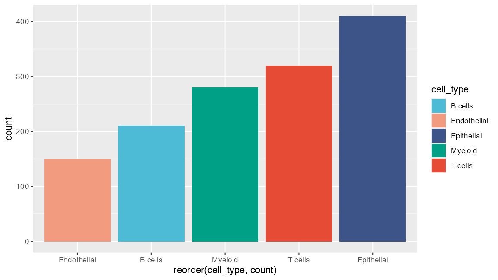

## Seurat integration

Create a named palette from Seurat identities:

``` r
seurat_colours <- cellpal_seurat(
  object = seurat_object,
  palette = "base"
)
cellpal_view(seurat_colours)
```

Apply it to a dimensional reduction plot:

``` r
Seurat::DimPlot(
  seurat_object,
  group.by = "seurat_clusters",
  cols = seurat_colours
)
```

You can also generate colours directly from identity levels:

``` r
seurat_colours <- cellpal_named(
  levels = levels(Seurat::Idents(seurat_object)),
  palette = "base"
)
cellpal_view(seurat_colours)
```

## Palette adjustment

### Lighten or darken colours

Positive values lighten colours:

``` r
lighter <- cellpal_lightness(
  "nature",
  amount = 0.2
)
cellpal_view(lighter)
```

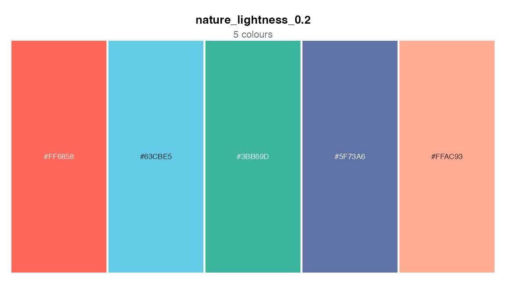

Negative values darken colours:

``` r
darker <- cellpal_lightness(
  "nature",
  amount = -0.2
)
cellpal_view(darker)
```

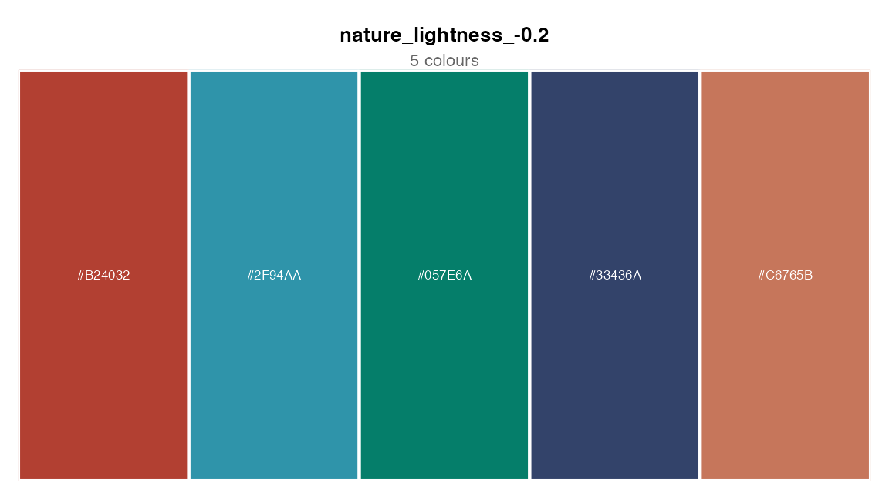

Adjust selected colours only:

``` r
adjusted <- cellpal_lightness(
  "nature",
  amount = 0.25,
  which = c(1, 3)
)
cellpal_view(adjusted)
```

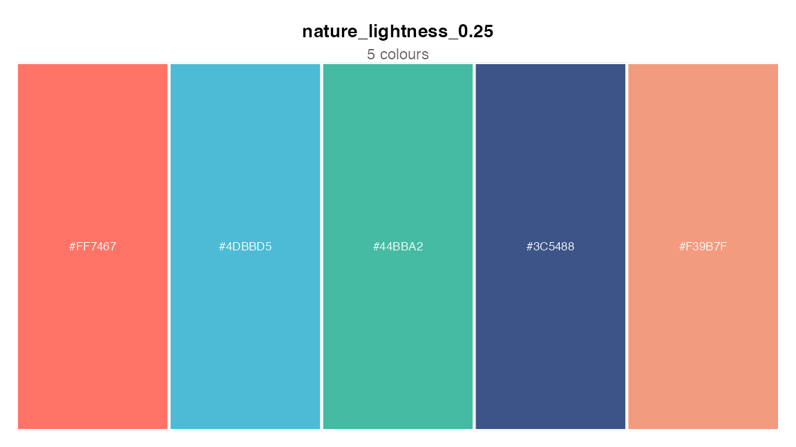

### Adjust every colour separately

``` r
custom_adjustment <- cellpal_adjust_each(
  "nature",
  adjustments = c(
    -0.15,
    0,
    0.10,
    0.20,
    -0.05
  )
)
cellpal_view(custom_adjustment)
```

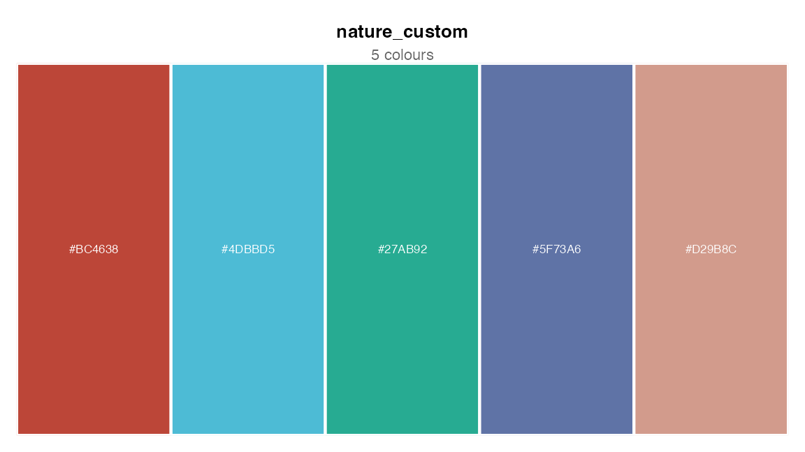

### Adjust saturation

``` r
muted <- cellpal_saturation(
  "nature",
  factor = 0.6
)
cellpal_view(muted)
```

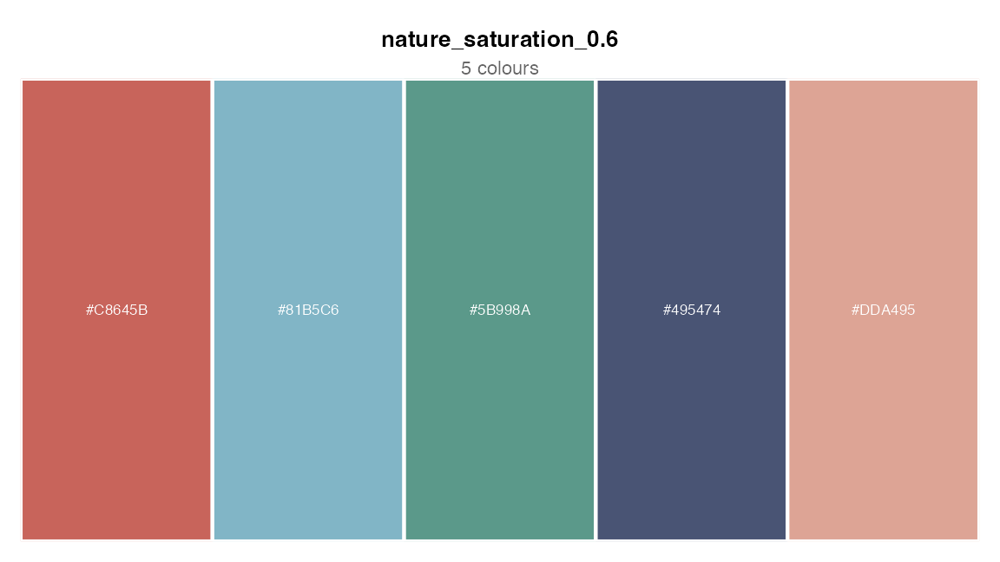

``` r

stronger <- cellpal_saturation(
  "nature",
  factor = 1.2
)
cellpal_view(stronger)
```

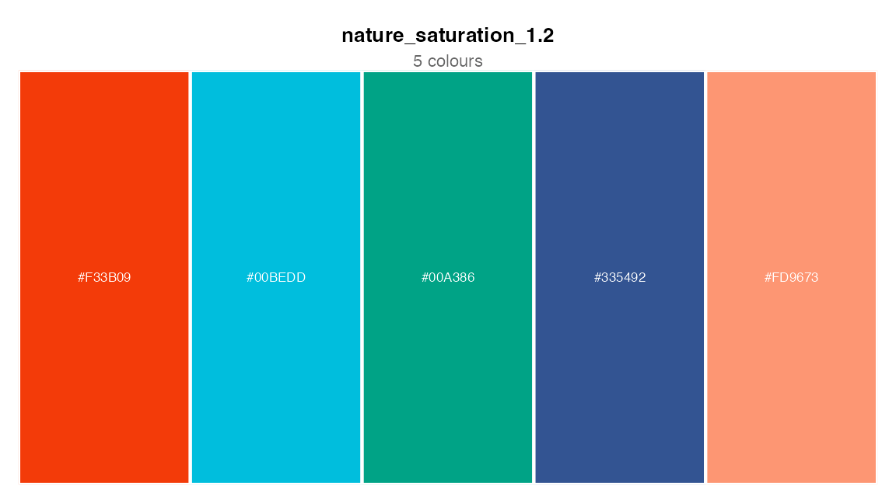

### Desaturate colours

``` r
desaturated <- cellpal_desaturate(
  "nature",
  amount = 0.5
)
cellpal_view(desaturated)
```

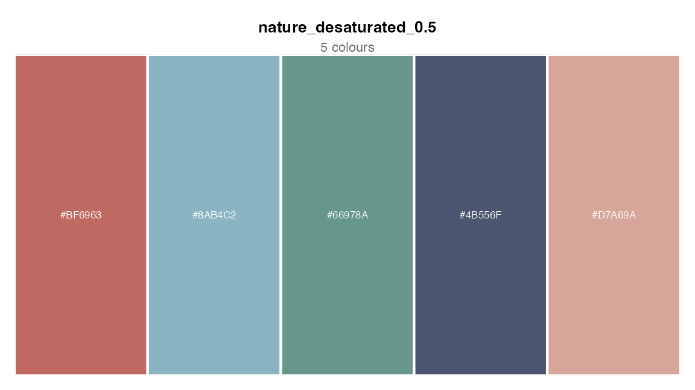

### Add transparency

``` r
transparent <- cellpal_alpha(
  "nature",
  alpha = 0.5
)
cellpal_view(transparent)
```

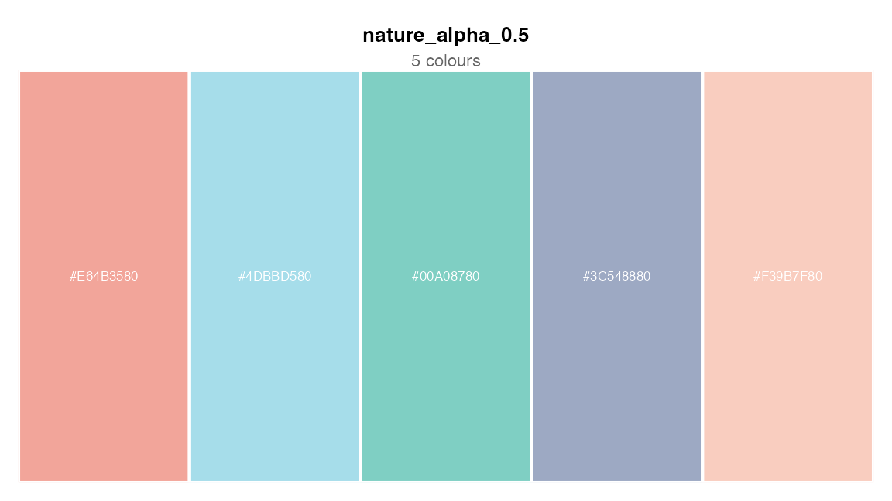

## Colour accessibility

### Simulate colour-vision deficiencies

``` r
cvd_palettes <- cellpal_simulate_cvd(
  "nature"
)

cvd_palettes$Normal
#> [1] "#E64B35" "#4DBBD5" "#00A087" "#3C5488" "#F39B7F"
#> attr(,"palette")
#> [1] "nature"
#> attr(,"palette_type")
#> [1] "categorical"
cvd_palettes$Deuteranopia
#> [1] "#9E8E2F" "#96A7D5" "#888889" "#365287" "#C6B87E"
cvd_palettes$Protanopia
#> [1] "#786C31" "#A9B6D6" "#999586" "#3F598A" "#B1A67D"
cvd_palettes$Tritanopia
#> [1] "#FD1747" "#00C4C3" "#00A299" "#125F67" "#FF8D94"
```

Visualize the simulations:

``` r
cellpal_cvd(
  "nature",
  severity = 1,
  labels = TRUE
)
```

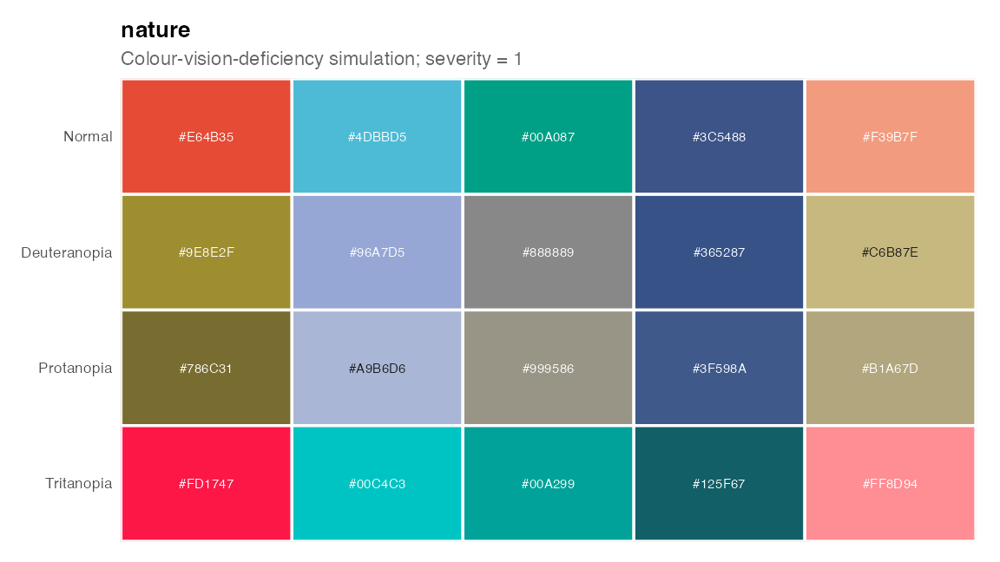

### Calculate contrast ratios

``` r
cellpal_contrast(
  "nature",
  background = c(
    "white",
    "black"
  )
)
#>    colour_index  colour background contrast_ratio aa_large aa_normal aaa_normal
#> 1             1 #E64B35    #FFFFFF       3.872797     TRUE     FALSE      FALSE
#> 2             2 #4DBBD5    #FFFFFF       2.237731    FALSE     FALSE      FALSE
#> 3             3 #00A087    #FFFFFF       3.292477     TRUE     FALSE      FALSE
#> 4             4 #3C5488    #FFFFFF       7.457980     TRUE      TRUE       TRUE
#> 5             5 #F39B7F    #FFFFFF       2.141560    FALSE     FALSE      FALSE
#> 6             1 #E64B35    #000000       5.422438     TRUE      TRUE      FALSE
#> 7             2 #4DBBD5    #000000       9.384505     TRUE      TRUE       TRUE
#> 8             3 #00A087    #000000       6.378176     TRUE      TRUE      FALSE
#> 9             4 #3C5488    #000000       2.815776    FALSE     FALSE      FALSE
#> 10            5 #F39B7F    #000000       9.805936     TRUE      TRUE       TRUE
```

### Calculate pairwise colour distances

``` r
cellpal_distances(
  "nature"
)
#>    colour_1_index colour_2_index colour_1 colour_2  distance
#> 1               1              2  #E64B35  #4DBBD5 108.03705
#> 2               1              3  #E64B35  #00A087 108.90634
#> 3               2              3  #4DBBD5  #00A087  33.37055
#> 4               1              4  #E64B35  #3C5488  95.00900
#> 5               2              4  #4DBBD5  #3C5488  47.14279
#> 6               3              4  #00A087  #3C5488  63.91931
#> 7               1              5  #E64B35  #F39B7F  38.26752
#> 8               2              5  #4DBBD5  #F39B7F  73.57350
#> 9               3              5  #00A087  #F39B7F  76.75449
#> 10              4              5  #3C5488  #F39B7F  73.81076
```

### Generate an accessibility report

``` r
accessibility_report <- cellpal_accessibility(
  "nature",
  minimum_distance = 15
)

accessibility_report
#> <cellpal accessibility report>
#> Palette: nature
#> Colours: 5
#> Minimum distance threshold: 15
#> All CVD simulations pass: no
#>        vision minimum_distance passes
#>        Normal         33.37055   TRUE
#>  Deuteranopia         24.95161   TRUE
#>    Protanopia         15.70663   TRUE
#>    Tritanopia         13.40804  FALSE
```

## Custom palettes

In addition to the built-in palettes, **cellpal** allows you to create
and register your own colour palettes.

Registered palettes behave exactly like built-in palettes and can be
used with all `cellpal` functions, including `cellpal()`,
`cellpal_view()`, and the `ggplot2` scales.

### Register a custom palette

``` r
cellpal_register(
  name = "my_palette",
  colours = c(
    "#264653",
    "#2A9D8F",
    "#E9C46A",
    "#F4A261",
    "#E76F51"
  ),
  type = "categorical"
)

cellpal_names()
#>  [1] "base"             "nature"           "nejm"             "lancet"          
#>  [5] "jama"             "tableau"          "tol"              "okabe_ito"       
#>  [9] "heatmap_blue_red" "heatmap_nature"   "viridis"          "my_palette"
```

Retrieve colours:

``` r
cellpal(
  palette = "my_palette",
  n = 5
)
#> <cellpal palette>
#> Name:    my_palette
#> Type:    categorical
#> Mode:    discrete
#> Colours: 5
#> 1: #264653
#> 2: #2A9D8F
#> 3: #E9C46A
#> 4: #F4A261
#> 5: #E76F51
```

### Preview the palette

``` r
cellpal_view("my_palette")
```

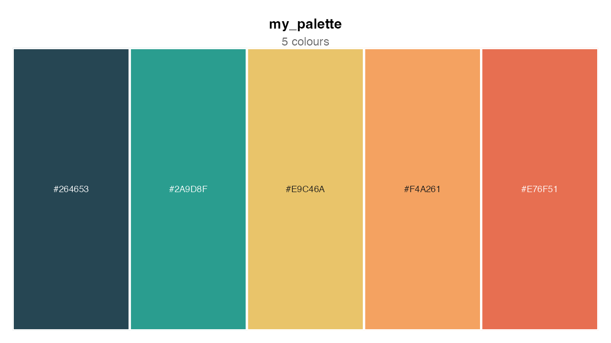

### Use the palette in ggplot2

``` r
library(ggplot2)

df <- data.frame(
  group = LETTERS[1:5],
  value = c(4, 7, 3, 9, 6)
)

ggplot(df, aes(group, value, fill = group)) +
  geom_col() +
  scale_fill_cellpal_d(
    palette = "my_palette"
  ) +
  theme_minimal()
```

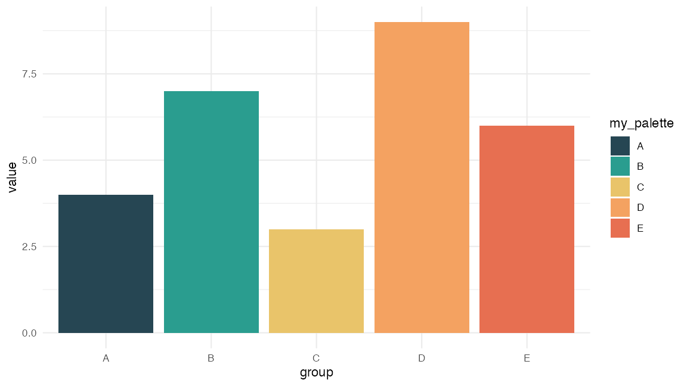

### List registered palettes

``` r
cellpal_custom_names()
#> [1] "my_palette"
```

### Remove a registered palette

``` r
cellpal_unregister("my_palette")
```

> **Note:** Registered palettes are available only during the current R
> session. If you restart R, they must be registered again.

## Heatmaps

Generate a continuous diverging palette:

``` r
heatmap_colours <- cellpal(
  palette = "heatmap_nature",
  n = 100,
  type = "continuous"
)
```

Use it with `pheatmap`:

``` r
set.seed(123)

# Simulated RNA-seq counts
counts <- matrix(
  rpois(20 * 10, lambda = 100),
  nrow = 20,
  dimnames = list(
    paste0("Gene_", 1:20),
    paste0("Sample_", 1:10)
  )
)

# Gene-wise Z-score normalization
expression_matrix <- t(
  scale(
    t(log2(counts + 1))
  )
)

heatmap_colours <- cellpal(
  "heatmap_nature",
  n = 100,
  type = "continuous"
)

pheatmap::pheatmap(
  expression_matrix,
  color = heatmap_colours,
  border_color = NA,
  cluster_rows = TRUE,
  cluster_cols = TRUE,
  main = "Normalized RNA-seq Expression"
)
```

Use it with `ComplexHeatmap`:

``` r
# heatmap_colours <- cellpal(
#   "viridis",
#   n = 100,
#   type = "continuous"
# )

ComplexHeatmap::Heatmap(
  expression_matrix,
  col = heatmap_colours
)
```

## Example single-cell colour workflow

``` r
cell_types <- c(
  "Basal",
  "Cycling basal",
  "Neuronal progenitor",
  "Immature neuron",
  "Mature neuron",
  "Sustentacular",
  "Microvillous",
  "Endothelial",
  "Mesenchymal"
)

cell_type_colours <- cellpal_named(
  levels = cell_types,
  palette = "base"
)

Seurat::DimPlot(
  seurat_object,
  group.by = "cell_type",
  cols = cell_type_colours,
  label = TRUE,
  repel = TRUE
)
```

## Design principles

1.  **Reproducibility**  
    Named mappings keep colours stable across analyses and figures.

2.  **Scientific readability**  
    Palettes are designed for figures, reports, presentations, and
    publications.

3.  **Accessibility**  
    Built-in tools help evaluate colour-vision-deficiency robustness and
    contrast.

4.  **Interoperability**  
    Colours can be used with `ggplot2`, Seurat, `pheatmap`,
    `ComplexHeatmap`, and base R.

5.  **Minimal dependencies**  
    Core palette generation remains lightweight and easy to integrate
    into existing workflows.

## Development

Run package tests:

``` r
devtools::test()
```

Generate documentation:

``` r
devtools::document()
```

Run a complete package check:

``` r
devtools::check()
```

Build this README from `README.Rmd`:

``` r
devtools::build_readme()
```

Build the pkgdown website:

``` r
pkgdown::build_site()
```

## Contributing

Contributions, bug reports, feature requests, and palette suggestions
are welcome.

Please open an issue with:

- a clear description of the problem or proposed feature;
- a minimal reproducible example;
- the output of `sessionInfo()`;
- screenshots when the issue concerns colour rendering or plot
  appearance.

## Citation

If you use `cellpal` in scientific work, please cite the package using:

``` r
citation("cellpal")
```

## License

`cellpal` is released under the MIT License.

## Author

**Yvon Mbouamboua**  
Bioinformatician and scientific software developer  
INSERM — Lille Neuroscience & Cognition, UMR-S 1172  
Lille, France
